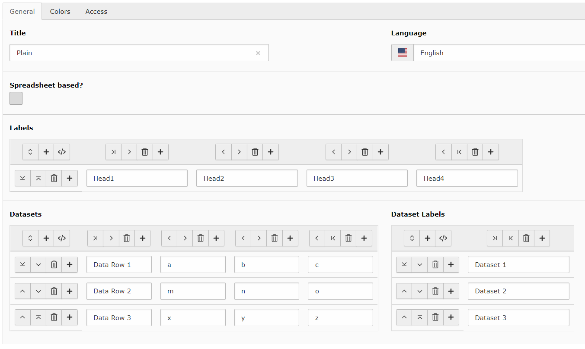
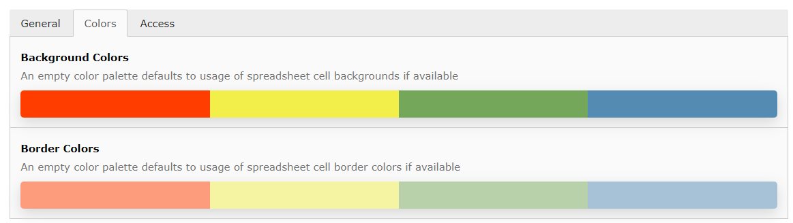
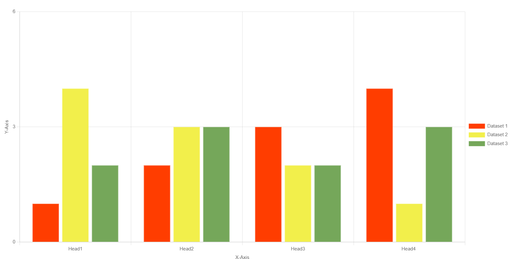
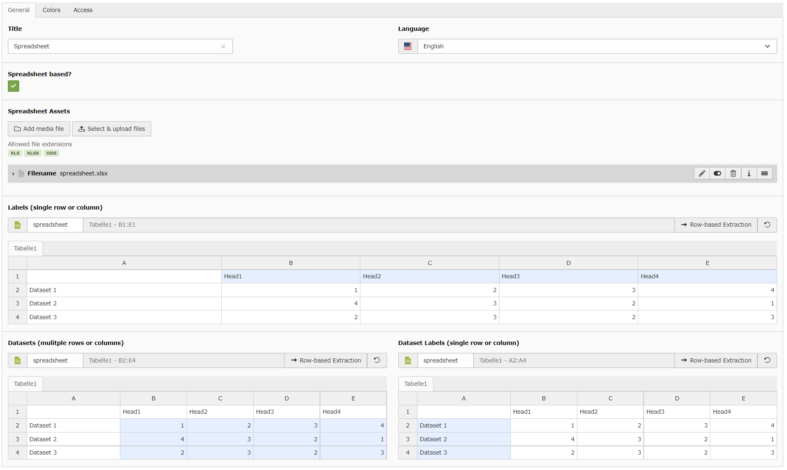
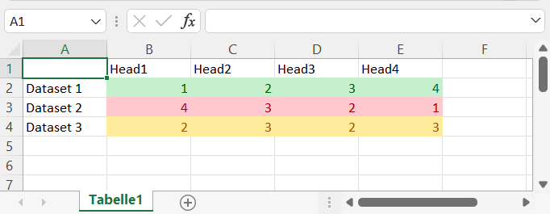
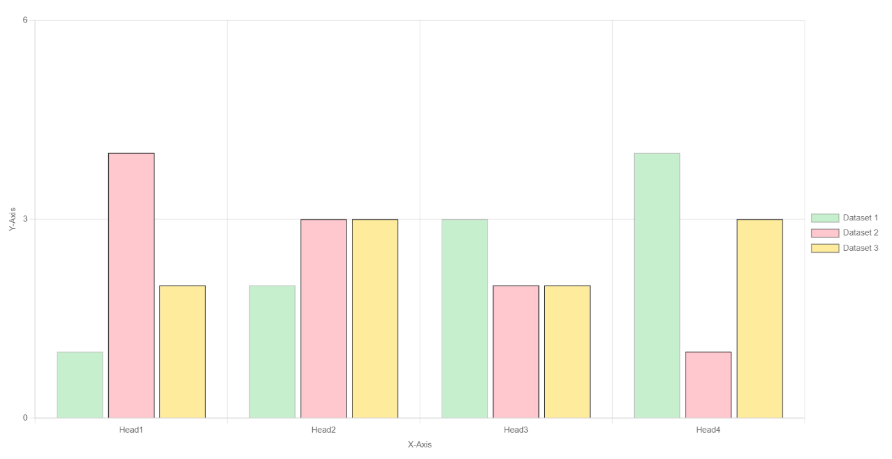
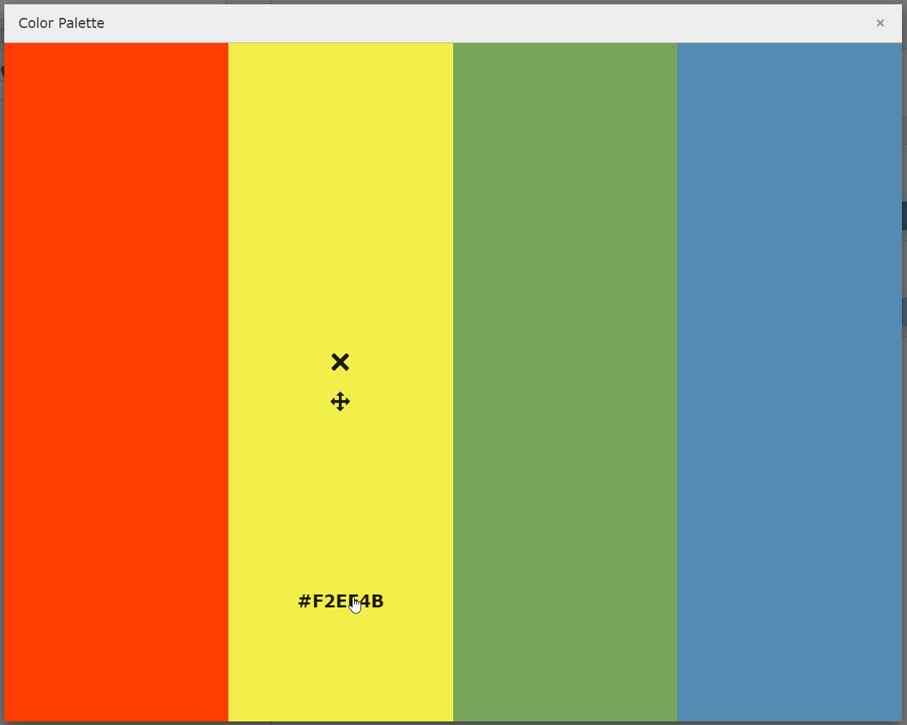
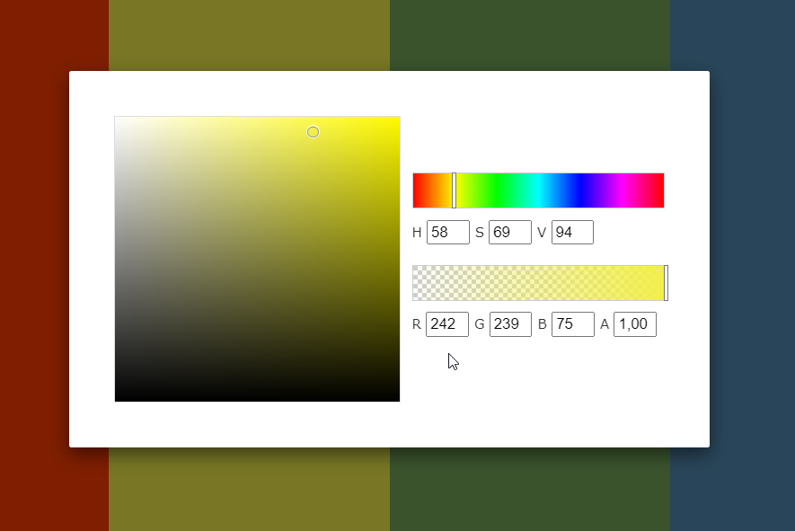

.. include:: ../Includes.txt

.. _for-editors:

===========
For Editors
===========

Target group: **Editors**

This extension will support editors & authors by providing

- ability to manage datasets consisting of data and labels
- fluid based content elements to display different chart types like bar, line, pie and etc.

.. hint::

   The usage of generating chart data can be improved by `Spreadsheet extension <http://typo3.org/extensions/repository/view/spreadsheets/>`_.
   So don't hesitate to check out that extension too 😁

.. _editor-create-dataset:

Chart Dataset
=============

Before creating a chart content element you need to create a dataset that can be used by chart libraries.
Go to list view and create a new chart data record. On default labels, data and data labels are configured with TYPO3's table wizard.

Per default you can create a dataset by using TYPO3's table wizard as you can see in following screenshot.
This dataset can then be adjusted by additionally using custom colors for background/border inside of the colors tab.
See :ref:`color palette editor <editor-content-element-color-palette>` for more information how to edit colors.

.. rst-class:: cc

   With such configuration the frontend will render for example the following Bar Chart.

Spreadsheet-based
-----------------

Following screenshots show how to create same dataset with spreadsheet data if your TYPO3 installation also provides the `spreadsheet extension <http://typo3.org/extensions/repository/view/spreadsheets/>`_.

.. rst-class:: cc

   This spreadsheet configuration does not have configured colors and thus uses the provided colors from spreadsheet cells.
   The following output may be rendered in frontend.

.. _editor-content-element-color-palette:

Color Palette Editor
====================

The color palette helps to define background and/or border configuration for your chart output in frontend.
After clicking on a palette a modal will open that shows the whole palette. Hover over an item to see the actions.
You can move or delete items. With a click on the Hex-Code the color-picker will open and you can change the color
by moving the pickers or typing the values for red, green, blue and/or alpha by yourself. As an addition you can also
adjust the HSV values (learn more on `HSL and HSV <https://en.wikipedia.org/wiki/HSL_and_HSV>`_).

.. _editor-content-element:

Content Element
===============

Start adding a new content element to your page as usual and select the tab "Charts" to see following overview:

.. image:: ../Images/chart-element-overview.png
   :alt: Default chart type elements list in new content element wizard
   :width: 300px

.. _editor-faq:

FAQ
===

Possible subsection: FAQ
