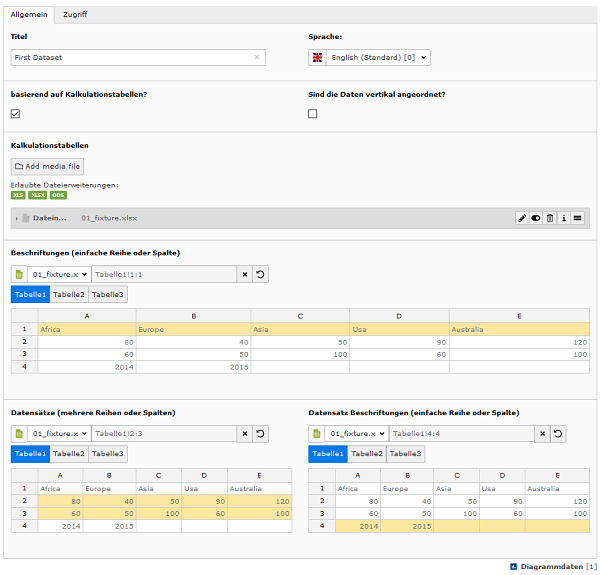
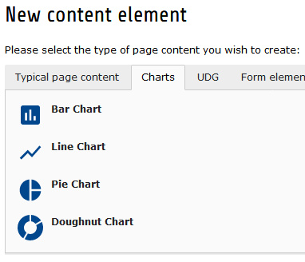

.. include:: ../Includes.txt

.. _for-editors:

===========
For Editors
===========

Target group: **Editors**

This extension will support editors & authors by providing

- ability to manage datasets consisting of data and labels
- fluid based content elements to display different chart types like bar, line, pie and etc.

.. hint::

   The usage of generating chart data can be improved by `Spreadsheet extension <http://typo3.org/extensions/repository/view/spreadsheets/>`_.
   So don't hesitate to check out that extension too 😁

.. _editor-create-dataset:

Chart Dataset
=============

Before creating a chart content element you need to create a dataset that can be used by chart libraries.
Go to list view and create a new chart data record. On default labels, data and data labels are configured with TYPO3's table wizard.

The following example screenshot shows you how to create such a dataset when your TYPO3 installation also provides the `spreadsheet extension <http://typo3.org/extensions/repository/view/spreadsheets/>`_.

.. _editor-content-element:

Content Element
===============

Start adding a new content element to your page as usual and select the tab "Charts" to see following overview:

.. _editor-ce-bar:

..
   Configure Bar Chart
   -------------------
   TODO!

.. _editor-ce-line:

..
   Configure Line Chart
   --------------------
   TODO!

.. _editor-ce-pie:

..
   Configure Pie Chart
   -------------------
   TODO!

.. _editor-ce-doughnut:

..
   Configure Doughnut Chart
   ------------------------
   TODO!

.. _editor-faq:

FAQ
===

Possible subsection: FAQ
