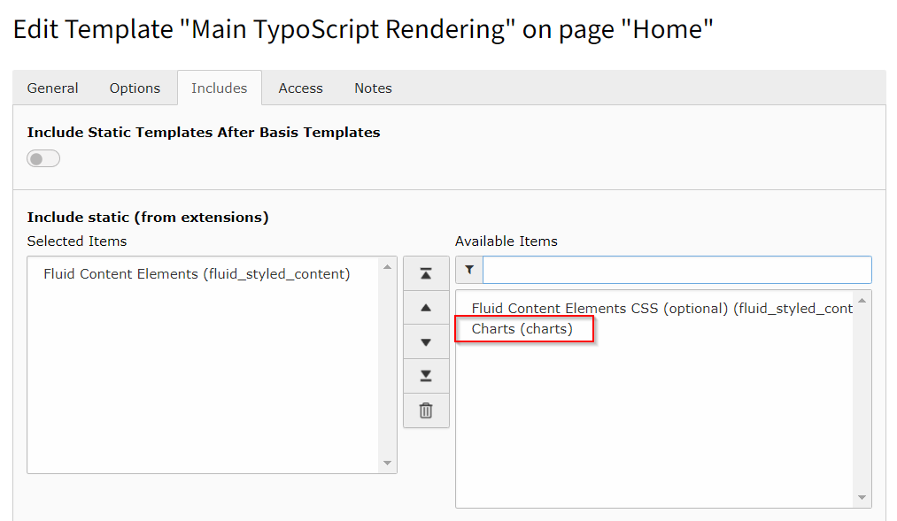

.. include:: ../Includes.txt

.. _installation:

============
Installation
============

Target group: **Administrators**

The extension needs to be installed as any other extension of TYPO3 CMS:

#. Switch to the module "Extension Manager".

#. Get the extension

   #. **Get it from the Extension Manager:** Press the "Retrieve/Update"
      button and search for the extension key *charts* and import the
      extension from the repository.

   #. **Get it from typo3.org:** You can always get current version from
      `http://typo3.org/extensions/repository/view/charts/
      <http://typo3.org/extensions/repository/view/charts/>`_ by
      downloading either the t3x or zip version. Upload
      the file afterwards in the Extension Manager.

   #. **Use composer**: execute `composer req hoogi91/charts` where your `composer.json` is located.

.. hint::

   You can also refer to general TYPO3 documentation, for example the
   :ref:`t3install:extension-installation`.

Latest version from git
-----------------------
You can get the latest version from git by using the git command:

.. code-block:: bash

   git clone git@github.com:hoogi91/charts.git

Preparation: Select Chart library in extension settings
-------------------------------------------------------

#. Navigate to :ref:`extension settings <t3install:the-install-tool-in-depth>`

#. open settings for **charts**

#. select chart library you wish to use for frontend rendering

#. optional disable the default caching of evaluated chart data

Preparation: Include static TypoScript
--------------------------------------

The extension ships some TypoScript code which needs to be included.

#. Switch to the root page of your site.

#. Switch to the **Template module** and select *Info/Modify*.

#. Press the link **Edit the whole template record** and switch to the tab *Includes*.

#. Select **Charts (charts)** at the field *Include static (from extensions):*

