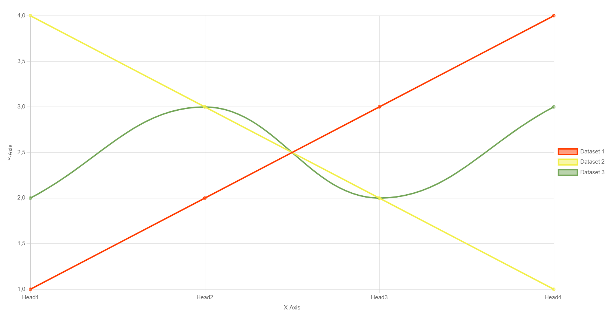
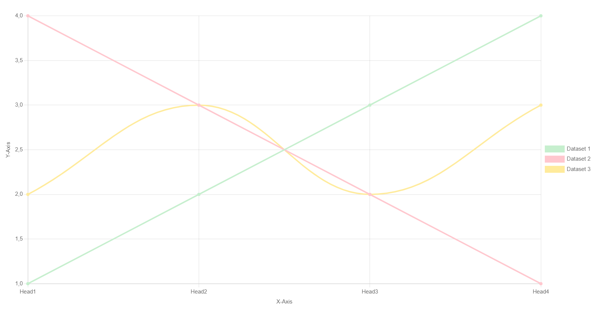
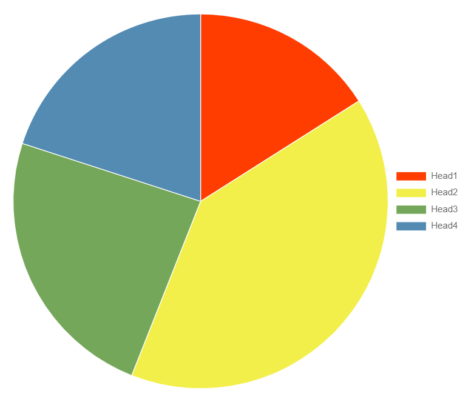
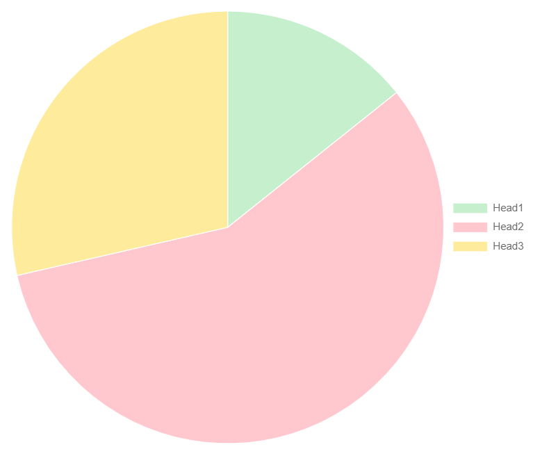
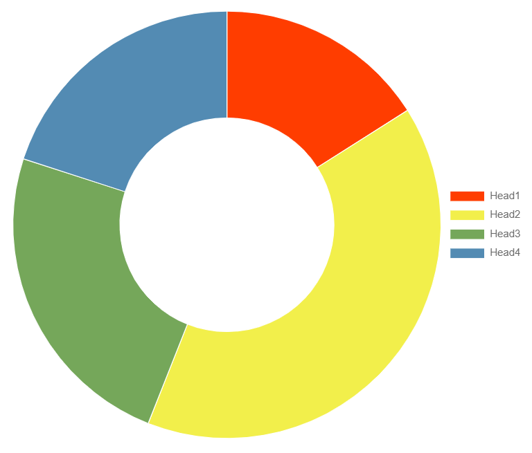
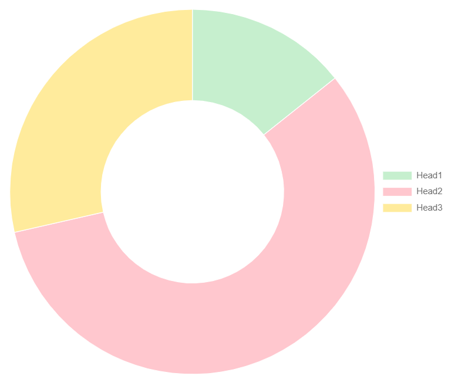

.. include:: ../Includes.txt

.. _introduction:

============
Introduction
============

.. _what-it-does:

What does it do?
================

With this extension you are able:

- to easily display static or dynamic chart types (bar, line, pie, etc.) from given data and labels
- to define TCA input fields that can extract selectable data from your worksheets

...but a picture is worth a thousand words so heads up to the screenshots below or dive into the :ref:`editor docs <for-editors>` 😁

.. _screenshots:

Screenshots
===========

.. rst-class:: float-left
.. figure:: ../Images/frontend-plain.png
   :alt: Frontend example of plain dataset based Bar Chart
   :width: 360px

   Bar Chart with plain dataset and custom color palette

.. rst-class:: float-right
.. figure:: ../Images/frontend-spreadsheet.png
   :alt: Frontend example of spreadsheet based Bar Chart
   :width: 360px

   Bar chart using data and colors from spreadsheet

.. rst-class:: float-left

   Line Chart with plain dataset and custom color palette

.. rst-class:: float-right

   Line chart using data and colors from spreadsheet

.. rst-class:: float-left

   Pie Chart with plain dataset and custom color palette

.. rst-class:: float-right

   Pie chart using data and colors from spreadsheet

.. rst-class:: float-left

   Doughnut Chart with plain dataset and custom color palette

.. rst-class:: float-right

   Doughnut chart using data and colors from spreadsheet

.. important::
   :class: cc

   Please note that above right-side examples require installation of `Spreadsheet extension <http://typo3.org/extensions/repository/view/spreadsheets/>`_
