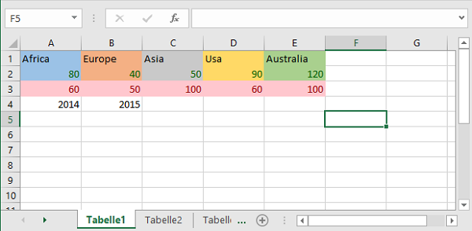

# TYPO3 Extension ``charts``

> Extension to create datasets and show them as line, bar, pie or doughnut chart in frontend

## Features
- Based on extbase & fluid, implementing best practices from TYPO3 CMS
- Supporting editors & authors by providing
	- records to create data for charts incl. labels, data and dataset-labels
	- fluid based content elements to display charts (bar, line, pie or doughnut) in frontend
	- (optional) fill data records for charts with informations from spreadsheets when [spreadsheet](https://extensions.typo3.org/extension/spreadsheets/) extension is present in TYPO3 installation 
- Supporting administrators & developers by providing
	- select option in extension manager to manage/set the preferred chart library
	- registry to add multiple chart libraries implementing at least the `Hoogi91\Charts\DataProcessing\Charts\LibraryInterface`
	- DataProcessors to get chart data, assets and their settings from Flexform configuration

## Users Manual
### Create Chart Data
Before creating a chart content element you need to create a dataset that can be used by chart libraries.
Go to list view and create a new chart data record. On default labels, data and data labels are configured with TYPO3's table wizard.

If you have [spreadsheet](https://extensions.typo3.org/extension/spreadsheets/) extension installed in your TYPO3 installation then the following screen shows how to select data correctly.
 


### Create Chart Content Element
Create a new element in TYPO3 backend and select tab "Charts" and then the chart type you want to create

")

If using [spreadsheet](https://extensions.typo3.org/extension/spreadsheets/) extension and the spreadsheet cells background is colored it will be (depending on used chart libray) used in frontend output as the following example shows:

| Excel Input File | Frontend Output with [Chart.js](https://www.chartjs.org/) |
| -------------- | --------------- |
|  |  |
_see above chart data selection on how to select labes and data from such an excel file_

## Developer Informations
To register your own or an overridden chart library please put the following in your `ext_localconf.php`:

```php
/** @var \Hoogi91\Charts\DataProcessing\Charts\LibraryRegistry $libraryRegistry */
$libraryRegistry = \TYPO3\CMS\Core\Utility\GeneralUtility::makeInstance(\Hoogi91\Charts\DataProcessing\Charts\LibraryRegistry::class);

// add new chart library
$libraryRegistry->register('my-chart-library', \Vendor\MyExtKey\DataProcessing\Charts\Library\MyChartLibrary::class);

// add override for default chart.js library
$libraryRegistry->register('chart.js', \Vendor\MyExtKey\DataProcessing\Charts\Library\ChartJs::class, true);
$libraryRegistry->register('chartist', \Vendor\MyExtKey\DataProcessing\Charts\Library\Chartist::class, true);
```